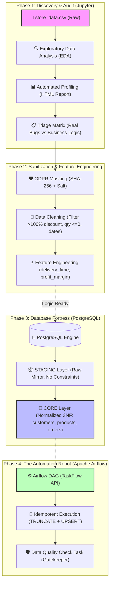
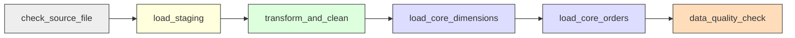

# 🕵️‍♂️ DataStore360: The Junior Data Engineer's Field Manual
### *From Dirty CSV to Bulletproof Automated Pipeline*

> *"In God we trust; all others must bring clean data."* — W. Edwards Deming

Welcome aboard, rookie! You’ve just been handed **`store_data.csv`**—a raw, messy, real-world retail dataset infected with missing values, impossible business numbers, chronology glitches, and naked personal data (GDPR alert!).

Your mission is to transform this raw chaos into an enterprise-grade, GDPR-compliant, automated data pipeline powered by **PostgreSQL**, **pgAdmin**, and **Apache Airflow**.

This manual is your secret weapon. Keep it open in PyCharm at all times.

---

## 🗺️ The Big Picture: High-Altitude Architecture

Here is the exact journey your data will take through your system:



---

## 🧭 The Evaluation Grading Rubric (Where Your Points Live)

Keep your eyes on the prize. Here is how your examiners will grade you on September 19:

| Domain | Weight | What the Examiner Actually Looks For |
|:---|:---:|:---|
| **1. Exploration & Data Quality** | **40%** | Depth of EDA, distribution plots, profiling report rigor, separating real anomalies from business quirks. |
| **2. GDPR Compliance & Transformation** | **20%** | Salted SHA-256 implementation, solid cleaning rules, business metrics (`delivery_time`, `profit_margin`). |
| **3. Pipeline & Database Architecture** | **20%** | Clean Staging/Core separation, PK/FK constraints, Airflow DAG TaskFlow API, idempotency tests. |
| **4. Code Quality & Defense** | **20%** | Clean project structure, `uv` packaging, `.env` security, `DOCUMENTATION.md` logbook, defense delivery. |

---

## 🔎 Phase 1: The Crime Scene Investigation (EDA & Profiling)
*Weight: 40% of your grade | Arena: Jupyter Notebook (`notebooks/01_eda.ipynb`)*

Your objective here is **NOT** to touch or fix anything yet. You are a detective inspecting the crime scene. You want to observe, quantify, and document every single irregularity.

### 🧪 Step 1: The Initial 60-Second Scan
Open your notebook and run these first sanity checks:

```python
import pandas as pd
import numpy as np

# Load the raw dataset
df = pd.read_csv("../data/raw/store_data.csv")

# 1. How big is the crime scene?
print(f"Dataset Shape: {df.shape[0]:,} rows and {df.shape[1]} columns")

# 2. Inspect data types and missing counts
df.info()

# 3. Look at the first 5 records with your own eyes
df.head()
```

> [!IMPORTANT]
> **Observation to write down in your logbook**: Notice that `Order Date` and `Ship Date` are imported as `object` (strings like `"11/8/2016"`), **not** datetimes! This is your first trap.

---

### 🪤 The Trap: String Comparison vs. Datetime Comparison

Look at what happens if you compare dates as text:
```python
# ❌ DANGEROUS MISTAKE (String comparison):
"11/11/2016" < "11/8/2016"  # Returns True! Because '1' comes before '8' in the alphabet!
```
Even though November 11 is **after** November 8, Python string comparison says it's smaller!

> [!TIP]
> **Pro-Tip & Hint**:
> Always parse dates before doing date logic!
> ```python
> df["Order Date"] = pd.to_datetime(df["Order Date"])
> df["Ship Date"] = pd.to_datetime(df["Ship Date"])
> ```

---

### 🚨 Step 2: The 5 Glitches to Hunt Down

Run these targeted queries to expose the dirty data:

#### Glitch #1: The Time-Travel Paradox (Shipping before Ordering)
```python
time_travelers = df[df["Ship Date"] < df["Order Date"]]
print(f"Orders shipped before being placed: {len(time_travelers)}")
time_travelers[["Order ID", "Order Date", "Ship Date"]].head()
```

#### Glitch #2: The Generous Retailer (Discounts > 100%)
```python
# A discount > 1.0 means the store is paying the customer to take the product!
freebies = df[df["Discount"] > 1.0]
print(f"Crazy discounts (>100%): {len(freebies)}")
freebies[["Order ID", "Sales", "Discount", "Profit"]].head()
```

#### Glitch #3: The Ghost Inventory (Negative or Zero Quantities)
```python
ghost_items = df[df["Quantity"] <= 0]
print(f"Invalid quantities (<=0): {len(ghost_items)}")
```

#### Glitch #4: The Impostor Clones (Exact Duplicates)
```python
dups = df.duplicated().sum()
print(f"Strict duplicate rows: {dups}")
```

#### Glitch #5: The Swiss Cheese Effect (Missing Values)
```python
missing = df.isna().sum()
missing[missing > 0]
```

---

### 📊 Step 3: The Automated Profiling Cheat Code (`ydata-profiling`)
Don't spend 4 hours drawing every single bar chart by hand. Use `ydata-profiling` to generate an enterprise-grade audit report in 60 seconds:

```python
from ydata_profiling import ProfileReport

profile = ProfileReport(
    df, 
    title="DataStore360 Data Quality & Integrity Audit", 
    explorative=True
)
profile.to_file("../reports/rapport_profiling.html")
```

> [!TIP]
> **Examiner Goldmine (The Triage Matrix)**:
> In your oral defense, show the **"Alerts"** tab of this report and explain your **triage**:
> - **Real Defects to Kill**: Discount > 100%, Quantity <= 0, Delivery < Order date, Duplicates.
> - **Legit Business Quirks to Keep**: Negative profits (`Profit < 0`). That is normal retail behavior (clearance sales, promotional loss leaders). Explain to the judge: *"A negative profit is not a data error; it's a financial loss on a discounted product!"* (This shows high business maturity).

---

## 🛡️ Phase 2: The Sanitization Protocol (GDPR & Cleaning)
*Weight: 20% of your grade | Arena: Jupyter Notebook & Python Functions*

Now that the audit is complete, let's write the cleaning and transformation functions.

### 🔒 Mission Alpha: GDPR Customer Masking (Salted SHA-256)
Under European GDPR, storing raw customer names (`Claire Gute`, `Sean O'Donnell`) in your warehouse without protection violates privacy principles.

#### Why Salted SHA-256?
1. **One-Way (Irreversible)**: You cannot decrypt `b28f...` back to `Claire Gute`.
2. **Deterministic (Relational Integrity)**: Every time `Claire Gute` buys something, her name turns into the **exact same hash**. You can still track customer retention and lifetime value without knowing who she is!
3. **The Salt**: Adding a secret key prevents rainbow table attacks (precomputed dictionaries of common names).

```python
import hashlib
import os

SECRET_SALT = os.getenv("RGPD_SALT", "datastore360_super_secret_salt_2026")

def pseudonymize_name(name: str, salt: str = SECRET_SALT) -> str:
    """Hashes customer name using SHA-256 with a secret salt."""
    if pd.isna(name) or name is None:
        return "UNKNOWN_ANONYMOUS"
    
    clean_str = str(name).strip().lower()
    salted_string = f"{salt}:{clean_str}"
    return hashlib.sha256(salted_string.encode("utf-8")).hexdigest()

# Test it:
test_hash = pseudonymize_name("Claire Gute")
print("Claire Gute hashed:", test_hash)
print("Length of SHA-256 hash:", len(test_hash), "characters (always 64 hex chars)")
```

---

### 🧹 Mission Beta: The 5 Cleaning Directives

Apply clear business decisions:

```python
def clean_dataset(raw_df: pd.DataFrame) -> pd.DataFrame:
    df = raw_df.copy()
    
    # 1. Kill strict duplicate rows
    df = df.drop_duplicates()
    
    # 2. Ensure dates are parsed
    df["Order Date"] = pd.to_datetime(df["Order Date"])
    df["Ship Date"] = pd.to_datetime(df["Ship Date"])
    
    # 3. Filter impossible business conditions
    valid_dates = df["Ship Date"] >= df["Order Date"]
    valid_discount = (df["Discount"] >= 0) & (df["Discount"] <= 1.0)
    valid_quantity = df["Quantity"] > 0
    valid_pks = df["Row ID"].notna() & df["Order ID"].notna()
    
    df_clean = df[valid_dates & valid_discount & valid_quantity & valid_pks].copy()
    
    # 4. Handle missing non-critical attributes (e.g. Postal Code)
    df_clean["Postal Code"] = df_clean["Postal Code"].fillna("00000").astype(str)
    
    # 5. Apply GDPR Masking
    df_clean["Customer Name"] = df_clean["Customer Name"].apply(pseudonymize_name)
    
    return df_clean
```

---

### ⚡ Mission Gamma: Feature Engineering (Derived Variables)

Your subject mandates creating two business variables:

1. **`delivery_time`**: Number of days between order and shipment.
2. **`profit_margin`**: Profit divided by Sales.

```python
def add_features(df: pd.DataFrame) -> pd.DataFrame:
    df = df.copy()
    
    # 1. Delivery time in integer days
    df["delivery_time"] = (df["Ship Date"] - df["Order Date"]).dt.days
    
    # 2. Profit margin with division-by-zero protection
    df["profit_margin"] = np.where(
        (df["Sales"].notna()) & (df["Sales"] != 0),
        (df["Profit"] / df["Sales"]).round(4),
        0.0
    )
    return df
```

---

## 🏛️ Phase 3: The Vault Architecture (PostgreSQL Staging vs Core)
*Weight: 20% of your grade | Arena: PostgreSQL & pgAdmin (`http://localhost:5050`)*

Why build two schemas (`staging` and `core`) instead of dumping everything into one table?
Because in professional engineering, you **never mix raw ingestion with business analytics**.

```
[store_data.csv] ──(COPY/INSERT)──> [staging.superstore_raw]
                                              │
                                   (Transform & Clean)
                                              ▼
                                   ┌──────────────────────┐
                                   │     CORE SCHEMA      │
                                   │ ┌──────────────────┐ │
                                   │ │  core.customers  │ │
                                   │ └────────┬─────────┘ │
                                   │          │ 1         │
                                   │          │ N         │
                                   │ ┌────────▼─────────┐ │
                                   │ │   core.orders    │ │
                                   │ └────────▲─────────┘ │
                                   │          │ N         │
                                   │          │ 1         │
                                   │ ┌────────┴─────────┐ │
                                   │ │  core.products   │ │
                                   │ └──────────────────┘ │
                                   └──────────────────────┘
```

### The Two Schémas Explained:
1. **`staging.superstore_raw` (The Mudroom)**:
   - Permissive types (`TEXT`, `VARCHAR`).
   - No primary keys, no foreign keys.
   - Purpose: Ingest incoming data rapidly without risking rejection.
2. **`core` Layer (The Cleanroom)**:
   - Normalized relational model (3NF).
   - `core.customers`: Primary Key `customerid`, `customername` is **only** the 64-char hash.
   - `core.products`: Primary Key `productid`.
   - `core.orders`: Primary Key `rowid`, Foreign Keys to `customers` and `products`.
   - Strict `CHECK` constraints:
     - `CHECK (discount >= 0 AND discount <= 1.0)`
     - `CHECK (quantity > 0)`
     - `CHECK (shipdate >= orderdate)`
     - `CHECK (deliverytime >= 0)`

---

## ⚙️ Phase 4: The Automation Engine (Apache Airflow)
*Weight: 20% of your grade | Arena: Airflow UI (`http://localhost:8080`)*

Airflow is your orchestration conductor. Instead of running a notebook by hand every morning, Airflow executes a **Directed Acyclic Graph (DAG)** automatically.

### The TaskFlow API Anatomy (`@dag` & `@task`)
Break your pipeline down into atomic, independent tasks:



### 🔁 The Secret Sauce: True Idempotence
> [!WARNING]
> **What is Idempotence?**
> If your DAG crashes midway or you hit **"Trigger DAG"** 5 times in a row, it must **never duplicate records or corrupt data**.

**How to guarantee idempotence:**
1. **On Staging**: Before inserting, execute `TRUNCATE TABLE staging.superstore_raw;`.
2. **On Core**: Use SQL **UPSERT** syntax:
   ```sql
   INSERT INTO core.customers (customerid, customername, segment, ...)
   VALUES (%s, %s, %s, ...)
   ON CONFLICT (customerid) DO UPDATE 
   SET customername = EXCLUDED.customername,
       segment = EXCLUDED.segment,
       updated_at = CURRENT_TIMESTAMP;
   ```

### 🛡️ The Gatekeeper: Data Quality Check Task
Always end your DAG with a verification task. If anything smells wrong, fail the task immediately:
- Check that tables are not empty (`COUNT(*) > 0`).
- Check referential integrity (zero orphan orders).
- Check that zero customer names are in plaintext (`LENGTH(customername) == 64`).

---

## 🎯 Phase 5: The Final Boss (35-Minute Defense Survival Guide)

Here is your exact playbook for the 35 minutes with the evaluation jury:

```
[00:00 - 05:00] ── 🎤 The Pitch (Context & Challenges)
[05:00 - 10:00] ── 💻 Live Demo (Airflow DAG + pgAdmin + Profiling HTML)
[10:00 - 20:00] ── 🔬 Code & Architecture Walkthrough
[20:00 - 25:00] ── 💬 Technical Q&A (Justifying Choices)
[25:00 - 35:00] ── ⚡ Live Scenario & Edge Cases
```

### 💣 3 Questions the Examiner WILL Ask & How to Win:

#### Question 1: *"Why did you use SHA-256 with a salt instead of just deleting customer names?"*
> **Your Answer**: *"Deleting the name entirely (anonymization) would break the analytical value: we could no longer calculate customer repeat purchase rates or customer lifetime value. By using deterministic SHA-256 with a secret salt, we achieve GDPR pseudonymization: the customer's true identity is mathematically protected, while retaining relational integrity across orders."*

#### Question 2: *"Why didn't you load the CSV directly into the core tables?"*
> **Your Answer**: *"In modern data architectures (ELT/ETL), separating Staging from Core is critical. Staging acts as an unaltered raw mirror of our source file. If business transformation rules change tomorrow, or if an audit is required, we still have the raw historic data untouched in staging."*

#### Question 3: *"How does your pipeline handle idempotency if Airflow re-executes a failed run?"*
> **Your Answer**: *"Staging is truncated upon each execution. For Core dimensions and facts, we utilize PostgreSQL's `ON CONFLICT DO UPDATE` (UPSERT). Running the DAG 1 time or 100 times produces the exact same clean state in PostgreSQL."*

---

## 📅 The 5-Day Battle Plan (September 14 - 19, 2026)

- [ ] **Day 1 (Monday, Sep 14)**:
  - Open `notebooks/01_eda.ipynb`.
  - Inspect shape, columns, and data types.
  - Run the 5 glitch detection queries.
  - Generate `reports/rapport_profiling.html`.
- [ ] **Day 2 (Tuesday, Sep 15)**:
  - Implement and test `pseudonymize_name()` with SHA-256 + salt.
  - Implement cleaning filters (discount, quantity, dates).
  - Calculate `delivery_time` and `profit_margin`.
- [ ] **Day 3 (Wednesday, Sep 16)**:
  - Connect pgAdmin (`http://localhost:5050`) to PostgreSQL.
  - Create the `staging.superstore_raw` table and test ingestion.
  - Create the `core.customers`, `core.products`, and `core.orders` tables with PK/FK and CHECK constraints.
- [ ] **Day 4 (Thursday, Sep 17)**:
  - Assemble the Airflow DAG in `dags/datastore360_dag.py`.
  - Trigger DAG in Airflow UI (`http://localhost:8080`).
  - Test idempotence by triggering the DAG 3 times consecutively.
- [ ] **Day 5 (Friday, Sep 18)**:
  - Fill out `DOCUMENTATION.md` (the technical logbook required for certification).
  - Push everything to GitHub with a clean `README.md`.
  - Rehearse the 35-minute presentation with a stopwatch.
- [ ] **Saturday, Sep 19**: **Defend the project and claim your certification! 🎓**
